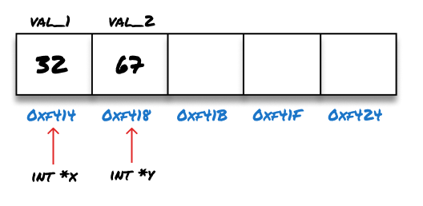
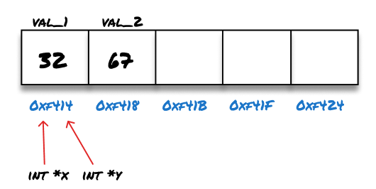

> [Code](https://github.com/rileymiller/riley-miller-personal-site/blob/master/content/blog/c++-pointers/main.cpp) referenced in article.

C++ pointers are an extremely powerful primitive in the programming language which allows developers to directly manipulate memory during program execution.

Pointers usually get a bad rap for being confusing or "dangerous" but once you dig in and begin to understand them, they're pretty intuitive.

The C++ [docs](http://www.cplusplus.com/doc/tutorial/pointers/) broke pointers down in a way that I really liked focusing on two commonly used operators when working with pointers: `*` and `&`.

## Pointer Initialization
Pointers are a data type that are used to store the memory addresses of other data types.
To initialize a pointer declare the data type, use the `*` operator, and then give the pointer
a name like the example below.

```cpp
int * x;
int * y;
```

## Address-of operator (&)
The docs refer to `&` as the "address-of" operator.

When the `&` is used to prefix data in C++, it returns the **memory address** of the data on the stack or heap.

```cpp
int a = 1;

int * x;

x = &a;

std::cout << x << std::endl;
```
**Outputs:**
```shell
$ ./address-of
0x2ABF1231
```

Since pointers store a _memory address_, this is typically how a pointer is initialized or set.

## Dereference Operator (*)
After a pointer is initialized, the `*` operator is used as the "value-of" operator. Where **dereferencing** a pointer returns the value
that is held in the memory address stored by the pointer.

```cpp
int a = 1;

int * x;

x = &a;

std::cout << *x << std::endl;
```
**Outputs:**
```shell
$ ./value-of
1
```

## Change Value of Pointed-to Data
One of the neat features of pointers is how they can be used to modify the data of the memory address
that is stored in the pointer. This is accomplished using the dereference operator (`*`) on the lhs of the expression.

```cpp
int a = 1;

int * x;

x = &a;

std::cout << *x << std::endl;

*x = 4;

std::cout << a << std::endl;
std::cout << *x << std::endl;
```
**Outputs:**
```shell
$ ./value-of
1
4
4
```

## Copy Pointers
Although Pointers have many interesting applications, they can also be copied and initialized just like
any other data type. When a pointer is set equal to another pointer, it will copy the memory address that was held
in the rhs of the expression into the pointer on the lhs of the expression. This can be expressed visually with two
simple steps.

**Step 1: Pointer Initialization**

**Step 2: Copy Pointer**


Here is the underlying code for the visualization above.

```cpp
int * x;
int * y;

int val_1 = 32;
int val_2 = 67;

x = &val_1;
y = &val_2;

std::cout << *x << std::endl;
std::cout << *y << std::endl;

x = y;

std::cout << *x << std::endl;
std::cout << *y << std::endl;
```
**Outputs:**
```shell
$ ./copy-pointer
32
67
67
67
```


