**Repo**: https://github.com/rileymiller/deploy-gatsby-s3-cloudfront-gh-actions

**Deployed Site**: http://gatsby-s3-tutorial.s3-website.us-east-2.amazonaws.com/

This tutorial will walk through the process of deploying a Gatsby site to an S3 bucket with 
GitHub Actions.

### 1. Create a git repo on GitHub[](#git-repo-on-github)

Create a repo using the GitHub UI.

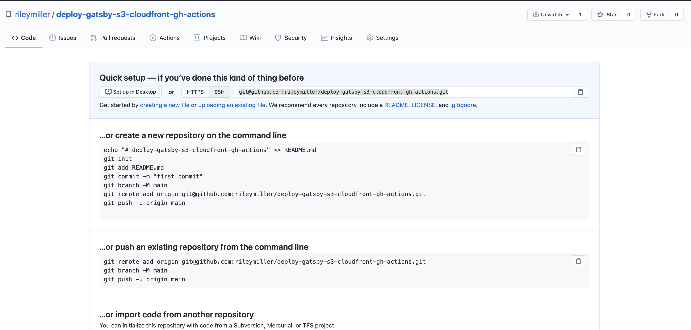

Then, create a local git repo and connect it to the remote git repo.

```bash
git remote add origin <remote_git_repo_url>
```

### 2. Bootstrap a Gatsby site
If you don't already have your development environment setup, here is a link to the [Gatsby documentation](https://www.gatsbyjs.com/docs/tutorial/part-zero/) to get your environment setup.

Most importantly, you need to have Node and the Gatsby CLI installed.

```bash
npm install -g gatsby-cli
```

Then, create a new Gatsby project from a starter:
```bash
gatsby new hello-world https://github.com/gatsbyjs/gatsby-starter-hello-world
```

### 3. Create an S3 bucket[](#create-s3)

From the AWS console, navigate to the S3 page using the search. 

This will take you to the S3 dashboard where you can view all of your S3 buckets. From here, click the "Create Bucket" button.

From the "Create bucket" page, we're going to set the S3 bucket up to host static assets and to be publicly accessible.

In the "General configuration" block, enter your bucket name and select the AWS region you'd like to host the S3 bucket in.

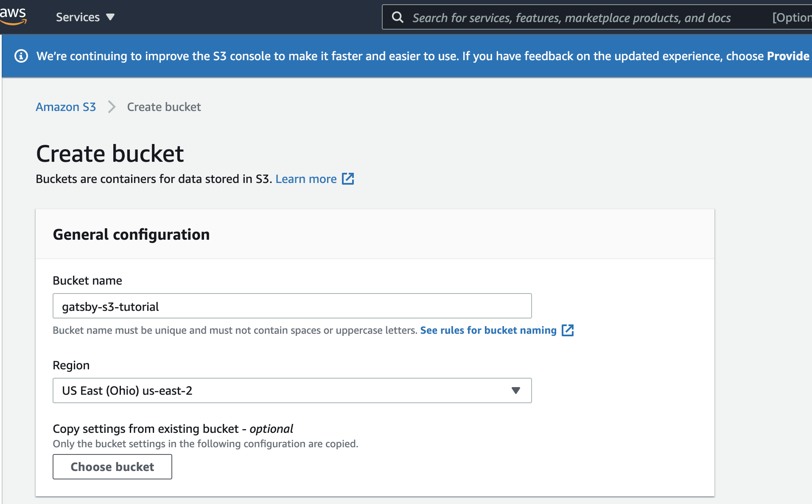

Then, in the "Bucket settings for Block Public Access" block, unselect "Block _all_ public access" box since we want our website assets to be publicly accessible on the web.

These are all of the settings we need to configure at this step, now scroll to the bottom of the "Create bucket" page and click the primary "Create bucket" button at the bottom of the page.

This will create the initial S3 bucket and take you back to the S3 dashboard. We now need to setup some additional configuration to enable our S3 bucket to serve our website. 

Click on the newly created S3 bucket.

Click on "Properties".

Scroll down to the end of the page to the "Static website hosting" section and click "Edit". Select enable. This will open up a host of other configuration options, the only things you need to change for this configuration are the "Index document" and "Error document" fields and you will set them to `index.html` which is the root of our Gatsby application.

 _Note: We handle application errors within the Gatsby Application so we want to point the "Error document" field to `index.html` as well._ 

 After this, click the "Save changes" button at the bottom of the page.

 We now have one final step to ensure that people can fetch our website assets from our S3 bucket.

 Under the S3 bucket, navigate to the "Permissions" tab. Then scroll down to the "Bucket policy" text area and paste in the following policy for the S3 bucket:
 ```json {5-12}
 {
    "Version": "2012-10-17",
    "Statement": [
        {
            "Sid": "PublicRead",
            "Effect": "Allow",
            "Principal": "*",
            "Action": [
                "s3:GetObject",
                "s3:GetObjectVersion"
            ],
            "Resource": "arn:aws:s3:::<name_of_s3_bucket>/*"
        }
    ]
}
```

Where `<name_of_s3_bucket>` is the name of the S3 bucket specified during the initial creation. This bucket policy will assign public read permissions so that users can fetch our website assets from our S3 bucket.

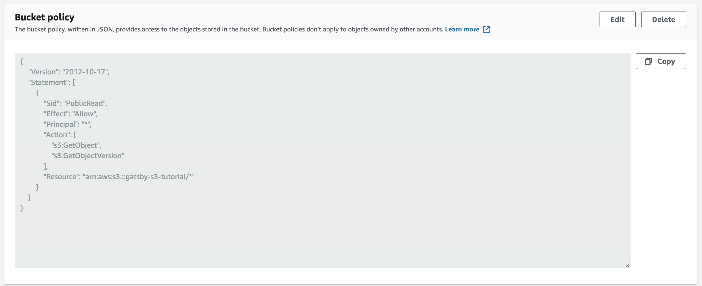

You should now see an indicator by the S3 bucket name that the bucket is "Publicly Accessible".

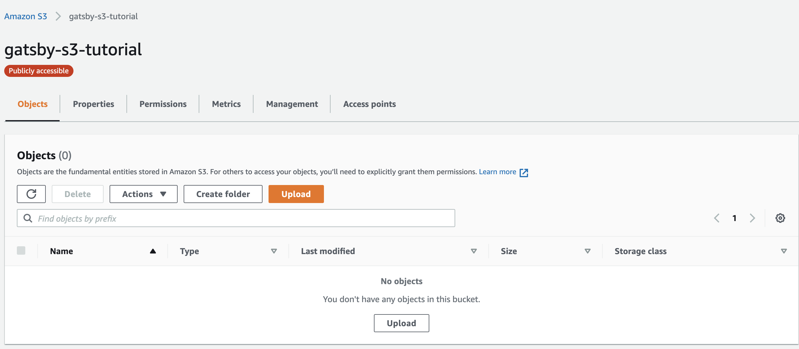

 The S3 bucket is now enabled to host the Gatsby site, we're now going to setup an IAM user to allow us to push objects to this S3 bucket from our CI system.

 ### 4. Create an IAM User to allow our GitHub Action to push to our S3 Bucket[](#create-iam-user)

 In the AWS search bar, search for "IAM" and select the option to navigate to the IAM dashboard.

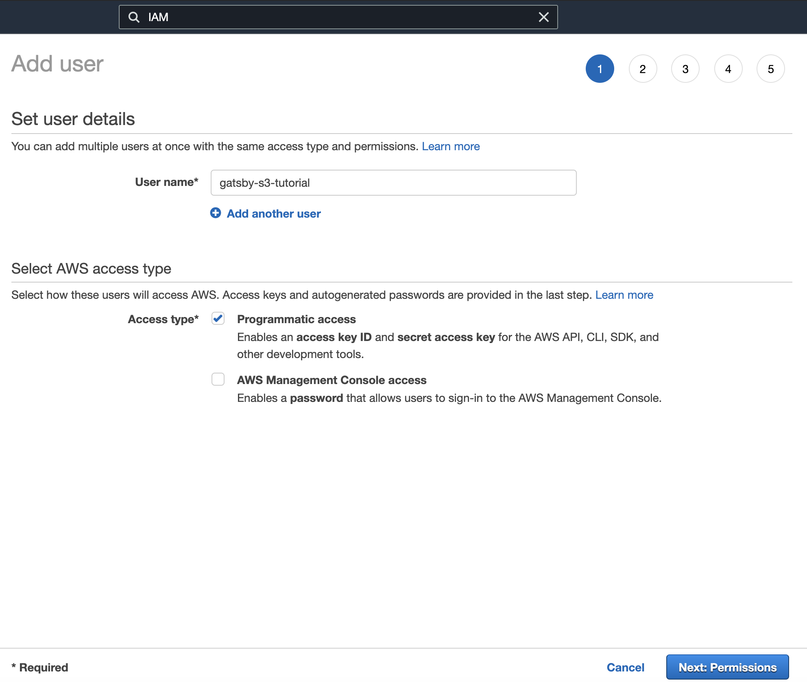
 Now click on the "Users" option under "IAM resources". Click the "Add user" button.

 On the first page of the create user screen, give the IAM user a username and under "Select AWS access type" choose the "Programmatic access" option.

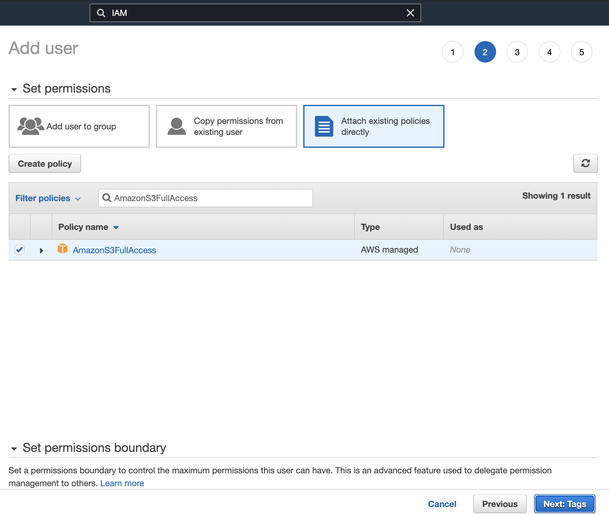

 Click the "Next" button.

 On the permissions screen, click "Attach existing policies directly" and in the "Filter policies" search bar, search for "AmazonS3FullAccess". This will give the IAM user the ability to push to the S3 bucket programatically from our CI system. Click the "Next" button. 

 We don't need to add any tags to the IAM user at this time so click "Next".

Review the configuration options for the IAM user and finally click the "Create user" button.

✨ After creating the user, record the IAM user credentials. We will use the credentials of the IAM user to interact with our S3 bucket via GitHub Actions. ✨

_Note: You can download these credentials as a csv file which can sometimes make it easier to reference these credentials in the future._

### 5. Add the AWS secrets to the GitHub repo [](#gh-secrets)
In order to protect the confidentiality of the AWS credentials and the name of the publicly S3 bucket we will need to add these as 
secrets in the GitHub repo.

Start by navigating to the GitHub repo you created in [Step 1](#git-repo-on-github).

Click on the "Settings" tab and then select the "Secrets" tab on the "Settings" page.

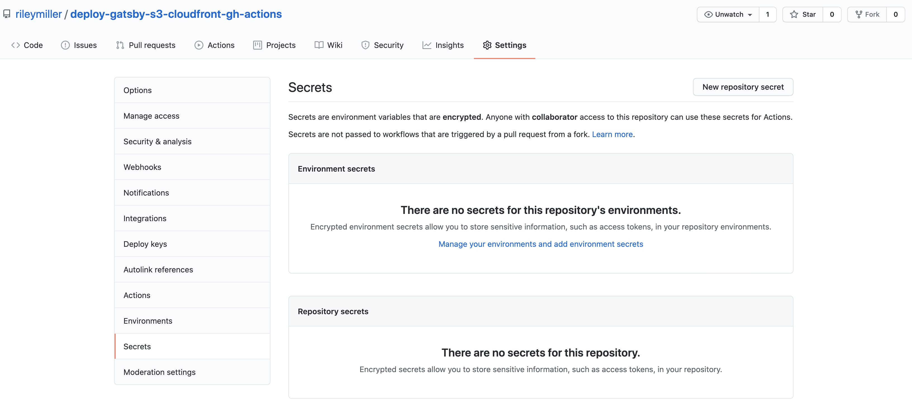

We're now going to add 3 secrets that will encrypt our AWS credentials so we can use them safely in our Continuous Deployment job.

Start by clicking the "New repository secret" button.

The first credential will be `AWS_ACCESS_KEY_ID`. Under the new secret page, set the name of the secret to `AWS_ACCESS_KEY_ID` and paste the access key id of the IAM user we created in [Step 4](#create-iam-user).

The next secret we will add to the repo will be `AWS_SECRET_ACCESS_KEY`. This will be the secret access key of the IAM user we created in [Step 4](#create-iam-user).

The last secret we will add will be `AWS_S3_BUCKET`. This will be the name of the S3 bucket we created in [Step 3](#create-s3).

You're now ready to craft the the GitHub Workflow to deploy our site to the S3 bucket.

### 6. Setup the GitHub Actions to deploy the site to S3


Scroll down to the bottom of the page and select the "Manual Workflow" option.

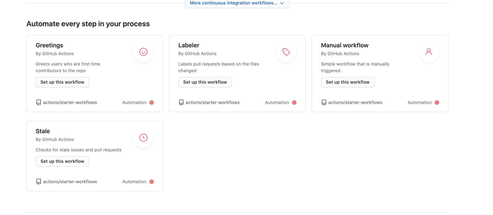

This will create a pre-populated GitHub workflow.

Now you will paste in the following workflow into the GitHub editor:
```yaml
name: Deploy

on:
  push:
    branches:
      - master
jobs:
  deploy:
    runs-on: ubuntu-latest

    steps:
      - name: Checkout
        uses: actions/checkout@v2
      - name: Use Node.js 14
        uses: actions/setup-node@v1
        with:
          node-version: 14.x
      - name: Build
        run: |
          yarn install && yarn build
      - name: Configure AWS Credentials
        uses: aws-actions/configure-aws-credentials@v1
        with:
          aws-access-key-id: ${{ secrets.AWS_ACCESS_KEY_ID }}
          aws-secret-access-key: ${{ secrets.AWS_SECRET_ACCESS_KEY }}
          aws-region: us-east-2
      - name: Deploy
        uses: jonelantha/gatsby-s3-action@v1
        with:
          dest-s3-bucket: ${{ secrets.AWS_S3_BUCKET }}
```

This workflow has several steps in it that we'll walk through.

```yaml {1,6}
name: Deploy

on:
  push:
    branches:
      - master
```

The first part of the workflow will specify the name of the workflow, `Deploy`.

Then the second rule, we specify that the workflow should only be run when there is a push to the master branch. This allows us
to automate the deployment of our site anytime there is a commit. This is super useful and allows us to improve our development velocity.

```yaml {1-3}
jobs:
  deploy:
    runs-on: ubuntu-latest

    steps:
      - name: Checkout
        uses: actions/checkout@v2
      - name: Use Node.js 14
        uses: actions/setup-node@v1
        with:
          node-version: 14.x
      - name: Build
        run: |
          yarn install && yarn build
      - name: Configure AWS Credentials
        uses: aws-actions/configure-aws-credentials@v1
        with:
          aws-access-key-id: ${{ secrets.AWS_ACCESS_KEY_ID }}
          aws-secret-access-key: ${{ secrets.AWS_SECRET_ACCESS_KEY }}
          aws-region: us-east-2
      - name: Deploy
        uses: jonelantha/gatsby-s3-action@v1
        with:
          dest-s3-bucket: ${{ secrets.AWS_S3_BUCKET }}
```
The next part of the workflow is the job definition itself. This job highlights the power of GitHub Actions and how we're able
create a custom workflow using a series of composable, atomic options to customize our Continuous Deployment job to our likening.

Inside the `jobs` definition we only have one job that we are naming `deploy`. 

Directly underneath the `deploy` job we specify the environment that the job should run in. This specification will create a Docker container with the image specified by the `runs-on` option.

Next, we will define the job "steps" and string together our series of composable GitHub actions to publish our site to our S3 bucket.

```yaml
      - name: Checkout
        uses: actions/checkout@v2
```

You can see that the syntax of defining a GitHub workflow job specifies a `name` and the GitHub action the step will use under the `uses` option.

This first step in the job will checkout the main branch of the GitHub repo into the container environment.


```yaml
      - name: Use Node.js 14
        uses: actions/setup-node@v1
        with:
          node-version: 14.x
```

The next step in the job will setup Node in the job environment. This will allow us to build our site using the JavaScript runtime. We use the `actions/setup-node@v1` action and specify that we want to use version 14 of Node.

```yaml
      - name: Build
        run: |
          yarn install && yarn build
```

Next we will install all of the project's dependencies and build the Gatsby project so that it's ready to deploy to our S3 bucket.

```yaml {2,4-6  }
      - name: Configure AWS Credentials
        uses: aws-actions/configure-aws-credentials@v1
        with:
          aws-access-key-id: ${{ secrets.AWS_ACCESS_KEY_ID }}
          aws-secret-access-key: ${{ secrets.AWS_SECRET_ACCESS_KEY }}
          aws-region: us-east-2
```

Next up, we configure the AWS credentials that we will use to connect to the S3 bucket from the container running the job. In this step of the GitHub workflow, we use the secrets we created for the GitHub repo in [Step 5](#gh-secrets) to configure our AWS variables in the job. The syntax for accessing these secrets in a GitHub repo is by using the following convention: `${{ secrets.AWS_ACCESS_KEY_ID }}`.

_Note: You also need to set the `aws-region` parameter of the `aws-actions/configure-aws-credentials@v1` action. This parameter should be the availability zone that you created your S3 bucket in._

```yaml {2,4}
      - name: Deploy
        uses: jonelantha/gatsby-s3-action@v1
        with:
          dest-s3-bucket: ${{ secrets.AWS_S3_BUCKET }}
```

Now that we have the AWS credentials configured in the job, we will use a GitHub Action, `jonelantha/gatsby-s3-action@v1` to actually deploy the site to the S3 bucket.

After pasting in the workflow and configuring it with your environment variable and availability zone. Commit the workflow definition file to your GitHub repo using the GitHub UI.

At this point, if you navigate to the "Actions" tab in the GitHub UI—you should see a job called `deploy` which should have a green checkmark next to it like the screenshot below if the job ran successfully.

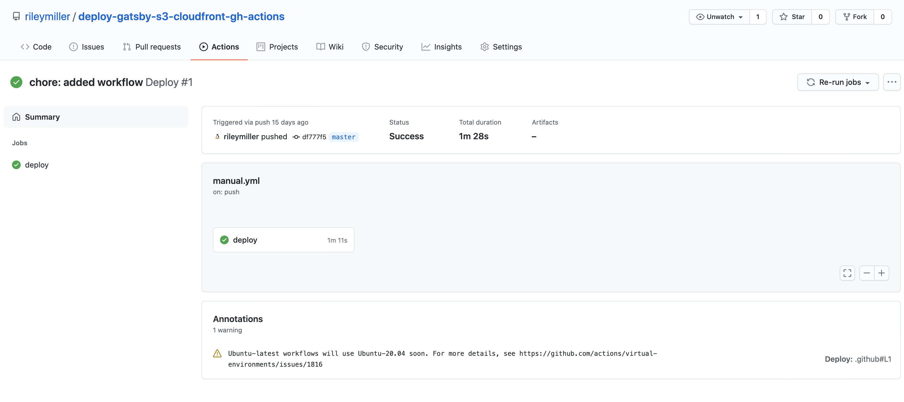

This means the the GitHub action successfully deployed the site to your S3 bucket!

### 7. Access the Site
AWS automatically generates a domain for publicy accessible S3 buckets. To access this URL and view your deployed website, navigate back to the AWS > S3 console, click on the "Properties" tab, and scroll to the bottom of the page to the "Static website hosting" card to find the URL of your Gatsby site.

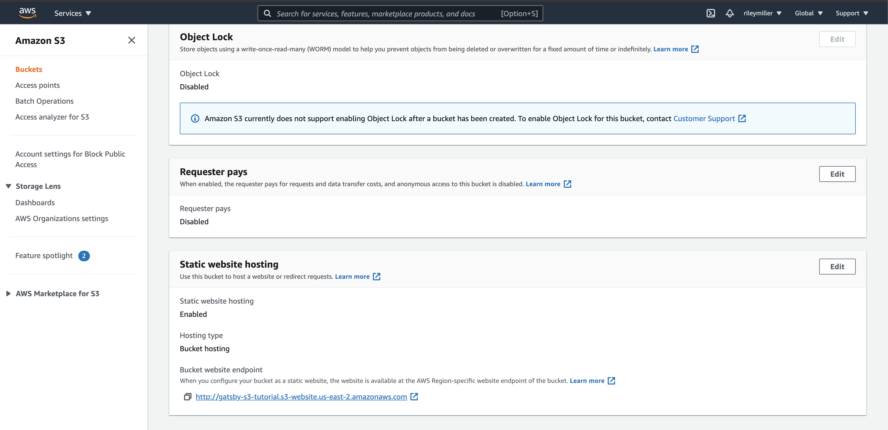

Click the link and view your deployed site!

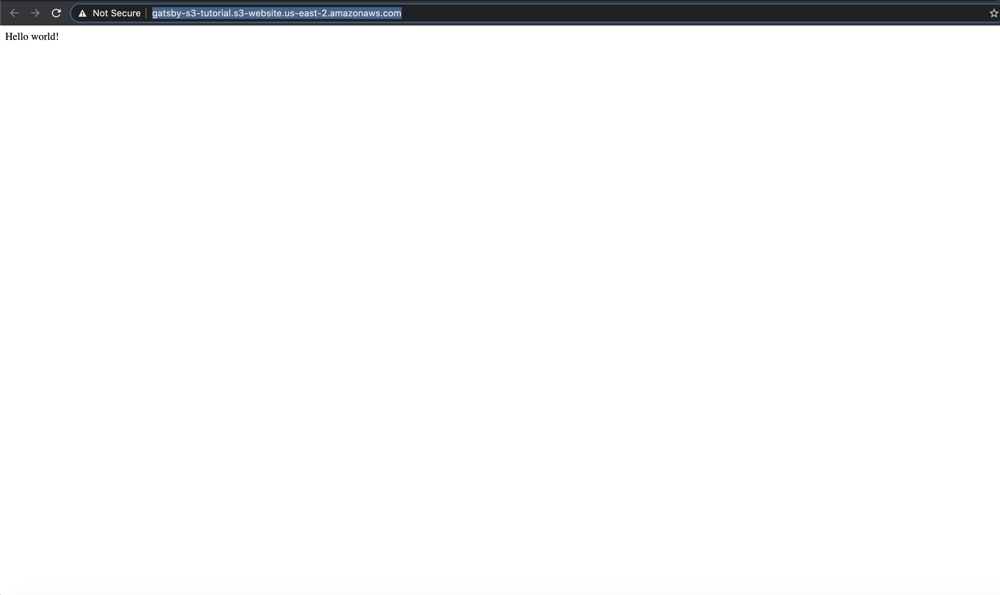


