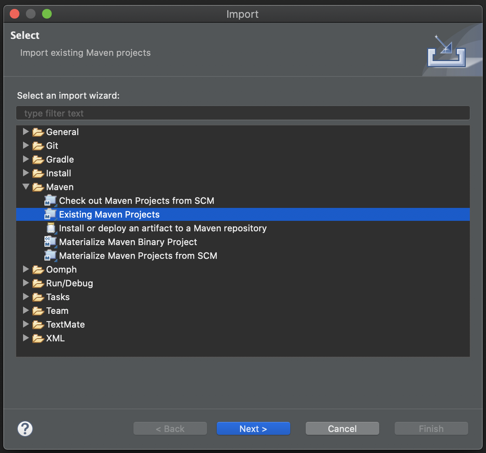
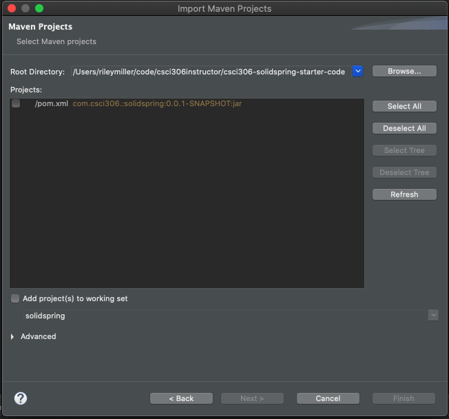
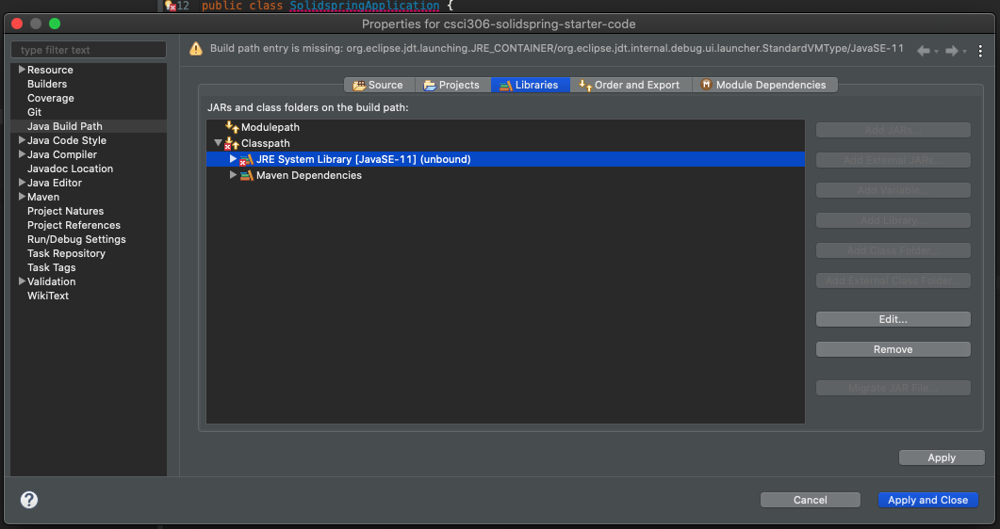
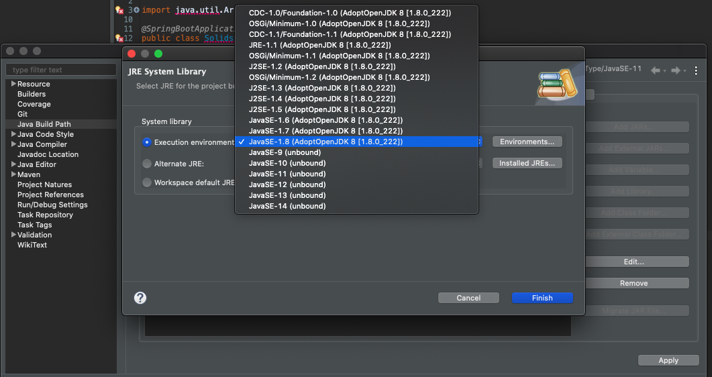
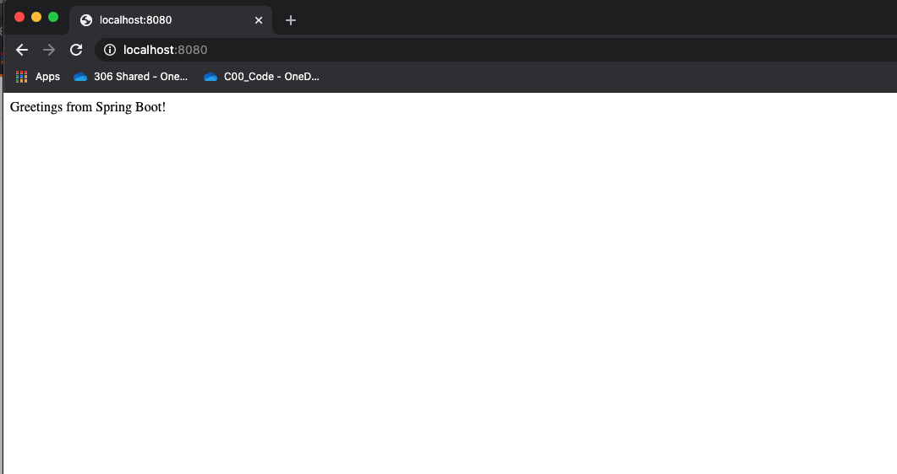

This article will take you through the setup process for the SOLID Spring Boot Assignments that we will be working through this week. In this article you'll receive context on the SOLID principles that heavily influence Object-oriented software design, context around what Spring Boot is and why we're using it, and will get the starter code for the assignments setup on your local computer.

## SOLID Principles

[SOLID Principles](https://en.wikipedia.org/wiki/SOLID) are a set of software design principles in [object-oriented programming](https://en.wikipedia.org/wiki/Object-oriented_programming) that are used to make software more maintainable, extensible, and flexible.

The theory of SOLID principles was introduced by Robert C. Martin in his paper [_Design Principles and Design Patterns_](https://web.archive.org/web/20150906155800/http://www.objectmentor.com/resources/articles/Principles_and_Patterns.pdf) and consists of 5 core principles:

**Single-responsibility principle**: A class should only have a single responsibility, that is, only changes to one part of the software's specification should be able to affect the specification of the class.

**Open-closed principle**: A module should be open for extension but closed for modification.

**Liskov substitution principle**: Instances of a class should be replaceable by instances of a derived class without altering correctness of the program.

**Interface segregation principle**: Many client-specific interfaces are better than one general-purpose interface.

**Dependency Inversion principle**: Depend upon abstractions. Do not depend upon concretions.

In this assignment we are going to create a lightweight API in [Spring Boot](https://spring.io/projects/spring-boot) to demonstrate these principles.

Before we begin, make sure that that you have Java and Eclipse installed.

## Spring Boot

[Spring Boot](https://spring.io/projects/spring-boot) is an open source Java-based framework that makes it really easy to get up and running building Spring [Micro Services](https://microservices.io/). 
Spring Boot automatically generates the majority of the dependencies and configuration so you can get started building logic in the application layer as soon as possible.

So far in the course you've used Java to build applications that can be run on your local computer while developing your understanding of Object-oriented design and proficiency in Java. This next series of assignments will be used to show you how powerful Java can be when used as a web-framework (Spring), and how your understanding of developing Java applications can translate to building full-blown enterprise applications that can be run on the cloud.
## Setup

To get setup, go ahead and clone the starter code with:
```shell
git clone git@github.com:rileymiller/solid-spring-canvas.git

# or

git clone https://github.com/rileymiller/solid-spring-canvas.git
```

or you can download the starter code from Canvas.

After you've completed that, change into the directory

```shell
cd solid-spring-canvas/
```
<br />
After downloading the starter code go ahead and open up the project in your Eclipse workspace importing it as a [Maven](https://maven.apache.org/) project into Eclipse. To do this select `File > Import > Maven > Existing Maven Projects`.



Then find the `solid-spring-canvas` directory using the `Browse...` option and set it as the `Root Directory`.



Depending on your Eclipse setup you may have some initial errors. To mitigate the issues right click in the Project Explorer and in the context menu
select `Build Path > Configure Build Path`.

My issue was with the `JRE System Library`, I had to click on `JRE System Library > Edit...`



Then I changed the `Execution environment` to JavaSE-1.8.



After clicking `Apply and Close`, all of the dependency issues should be resolved. If they're not, please reach out on Piazza or seek help during office hours to get setup.

Now that the build errors are resolved, go ahead and click the `Run` button and your Spring Boot server will start. The server will be run locally and will server from port 8080 by default. Depending on your local Eclipse setup, you may have multiple options for how to run the project. We want to run `SolidSpringApplication` as a `Java Application`.

After you've started your server, open up your favorite browser and enter `http://localhost:8080/` into the url. **Note: Make sure that your URL prefix is `http://` _not_ `https://` since the Tomcat server is not configured to work with SSL/TLS (HTTPS) out of the box.** If you're interested in how to enable Tomcat to work with SSL/TLS, checkout the [Tomcat documentation](https://tomcat.apache.org/tomcat-7.0-doc/ssl-howto.html).



Congrats! Entering that url into your browser sent an [HTTP GET](https://developer.mozilla.org/en-US/docs/Web/HTTP/Methods/GET ) request to the `/` (index) route being served by our Spring Boot application.

This route is defined and handled by the `HelloController` class.

```java
// HelloController.java
package solidSpring;

import org.springframework.web.bind.annotation.RestController;
import org.springframework.web.bind.annotation.RequestMapping;

@RestController
public class HelloController {

	@RequestMapping("/")
	public String index() {
		return "Greetings from Spring Boot!";
	}

}
```

<br />

The `@RestController` annotation is used to tell Spring that the class describes an [endpoint](https://smartbear.com/learn/performance-monitoring/api-endpoints/) that should be made available over the web.

The `@RequestMapping` annotation over the `index()` method is used to tell Spring that any HTTP request sent to the `/` route of the application should execute this method.

To stop the server, hit the red stop button in the Eclipse environment.

That's it for the article, you're now ready to take on the SOLID Spring Boot assignments.