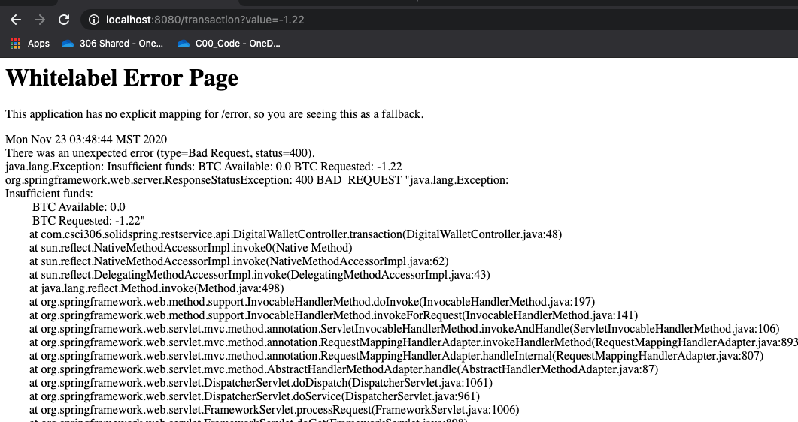

This article will take you through two of the SOLID principles as we build out a light-weight, cryptocurrency digit wallet API in
Spring Boot. By the end of this assignment you will have an understanding of the Single Responsibility Principle (SRP), the Liskov
Substitution Principle, and will have built a simple API for a [cryptocurrency digital wallet](https://www.investopedia.com/terms/d/digital-wallet.asp) that holds [Bitcoin](https://www.investopedia.com/terms/b/bitcoin.asp).

## SOLID Principles

To review, [SOLID Principles](https://en.wikipedia.org/wiki/SOLID) are a set of software design principles in [object-oriented programming](https://en.wikipedia.org/wiki/Object-oriented_programming) that are used to make software more maintainable, extensible, and flexible.

The theory of SOLID principles was introduced by Robert C. Martin in his paper [_Design Principles and Design Patterns_](https://web.archive.org/web/20150906155800/http://www.objectmentor.com/resources/articles/Principles_and_Patterns.pdf) and consists of 5 core principles:

**Single-responsibility principle**: A class should only have a single responsibility, that is, only changes to one part of the software's specification should be able to affect the specification of the class.

**Open-closed principle**: A module should be open for extension but closed for modification.

**Liskov substitution principle**: Instances of a class should be replaceable by instances of a derived class without altering correctness of the program.

**Interface segregation principle**: Many client-specific interfaces are better than one general-purpose interface.

**Dependency Inversion principle**: Depend upon abstractions. Do not depend upon concretions.

In this assignment we will deal with the **Single-responsibility principle** as well as the **Liskov subtitution principle**.

Before we start, make sure that you've completed the [setup](../java-solid-principles-spring-boot-pt1) for this assignment.

To clone the starter code run:
```shell
git clone git@github.com:rileymiller/csci306-solidspring-starter-code.git
```
## Starter Code

The basic functionality that we are implementing in our digital wallet API is the ability to:
- View the balance of our digital wallet
- Make transactions with our digital wallet
- Reset the balance of our digital wallet

In the starter code, there are two classes that are implemented which handle all of this functionality:

```
.../restservice/
				api/
					DigitalWalletController.java
				wallet/
					DigitalWallet.java
```

The `DigitalWalletController` class is a controller that handles the receiving and responding of web requests that reach any of the endpoints defined in the class.

```java
package com.csci306.solidspring.restservice.api;

import org.springframework.http.HttpStatus;
import org.springframework.web.bind.annotation.GetMapping;
import org.springframework.web.bind.annotation.RequestParam;
import org.springframework.web.bind.annotation.RestController;
import org.springframework.web.server.ResponseStatusException;

import com.csci306.solidspring.restservice.wallet.DigitalWallet;

@RestController
public class DigitalWalletController {

	@GetMapping("/balance")
	public DigitalWallet wallet() {
		return DigitalWallet
				.getInstance()
				.accountBalance();
	}
	
	@GetMapping("/transaction")
	public DigitalWallet transaction(
			@RequestParam(value = "value", defaultValue = "0" )
			String value ) 
	{
		try
		{
			double parsedValue = Double.parseDouble( value );
			
			try 
			{
				return DigitalWallet
						.getInstance()
						.processTransaction( parsedValue );
			}
			catch ( Exception e )
			{
				throw new ResponseStatusException(
						HttpStatus.BAD_REQUEST, e.toString() );
			}
			
		} 
		catch ( NumberFormatException e )
		{
			throw new ResponseStatusException(
					HttpStatus.BAD_REQUEST, e.toString() );
		}
	}
	
	@GetMapping("/zero")
	public DigitalWallet zero()
	{
		return DigitalWallet
				.getInstance()
				.zero();
	}
}
```

In this `DigitalWalletController` class, Spring uses the `@RestController` annotation above the class definition to signifiy that the class
describes and endpoint that should be made available over the web.

Inside the class there are three methods defined with a `@GetMapping(...)` annotation. This `@GetMapping(...)` annotation let's Spring know that whenever the [route](https://developer.wordpress.org/rest-api/extending-the-rest-api/routes-and-endpoints/) defined inside of the `@GetMapping(...)` is reached via HTTP - GET, the method defined for the route will be invoked to process the HTTP request.

If you take a look at the `transaction/` endpoint, you will notice it's a little different than the other two. Inside the method signature you will see `@RequestParam(value = "value", defaultValue = "0" ) String value` defined. `@RequestParam` is another special annotation that is used to tell Spring that there is a [HTTP parameter](https://www.tutorialspoint.com/http/http_parameters.htm) that is expected to be passed to the endpoint. Inside the annotation there are two paremeters, the first is the key of the parameter that is being passed as part of the HTTP - GET request (called "value" in this endpoint), and the second parameter is the default value in case an explicit parameter is not set as part of the request. Then outside of the annotation you can see `String value` also defined as part of the method signature. Essentially what is happening here, Spring is parsing the HTTP - GET request and if a parameter specified as `value` is passed in, it will serialize the request and store the value in the locally scoped parameter `String value` which can be used inside the scope of the method. 

For each of the endpoints defined inside of the `DigitalWalletController`, you can see that they all have a return type of a class named `DigitalWallet`. This return type is used to serialize a Java object into an HTTP response using a Java library called [Jackson2](https://github.com/FasterXML/jackson) that is configured automatically in Spring Boot. This process of serialization is essentially the conversion of a Java object to [JSON](https://www.w3schools.com/whatis/whatis_json.asp), or a format that clients (mobile/web) can recieve and process from our server.

Digging into this `DigitalWallet.java` class:
```java
package com.csci306.solidspring.restservice.wallet;

public class DigitalWallet {
	
	private static DigitalWallet wallet = new DigitalWallet();
	
	private static final String fName = "Bitcoin";
	private static final String fWhitePaper = "https://bitcoin.org/bitcoin.pdf";
	private double fBTC = 0;
	
	private DigitalWallet() { };
	
	public static DigitalWallet getInstance()
	{
		return wallet;
	}
	
	
	public DigitalWallet processTransaction( double amount ) throws Exception
	{
		if( fBTC + amount < 0 )
		{
			throw new Exception(
				String.format("\nInsufficient funds:\n\t BTC" +
				" Available: %1$s\n\t BTC Requested: %2$s",
				 fBTC, amount));
		} else {
			fBTC = fBTC + amount;
		}
		
		return this;
	}
	
	public DigitalWallet zero()
	{
		fBTC = 0;
		
		return this;
	}
	
	public DigitalWallet accountBalance()
	{
		return this;
	}
	
	/////////////////////////////////////////
	//	For Serialization
	////////////////////////////////////////
	public double getBTC() 
	{
		return fBTC;
	}
	
	public String getName()
	{
		return fName;
	}
	
	public String getWhitePaper()
	{
		return fWhitePaper;
	}
	
	public double getSatoshis()
	{
		return fBTC * 100000000;
	}

}
```

You can see that the class is making use of the [Singleton pattern](https://www.tutorialspoint.com/design_pattern/singleton_pattern.htm). `DigitalWallet` also has three instance attributes outside of the Singleton instance: `fName`, `fWhitePaper`, and `fBTC`. These attributes hold the name of Bitcoin, the link to the Bitcoin whitepaper, and the amount of Bitcoin in our digital wallet.

Inspecting the rest of the class, we can see the three methods that are invoked in `DigitalWalletController`: `processTransaction`, `zero`, and `accountBalance`. These classes handle transactions of Bitcoin in the digital wallet, set the amount of Bitcoin in our digital wallet to zero, and retrieve the balance of Bitcoin in the digital wallet respectively.

At the bottom of the class, you will see four methods that Spring uses to serialize the `DigitalWallet` instance to JSON: `getBTC`, `getName`, `getWhitePaper`, and `getSatoshis` (satoshis are the small atomic units that make up a Bitcoin). **Important: for a class that is serialized in Spring, any attribute "getter" (get\*) is automatically used for serialization.**

Now that we've run through all of the starter code, let start our server and play around with the API.

## API Walkthrough
To test the API, start your server in Eclipse and navigate to `http://localhost:8080` in the browser. You should see

```
Greetings from Spring Boot!
```

displayed in your browser.

Now let's test the three endpoints defined in the API so far.

### `balance/`
If you navigate to `http://localhost:8080/balance` in the browser, it will fetch the starting balance of the digital wallet and you should see:
```
{"name":"Bitcoin","btc":0.0,"whitePaper":"https://bitcoin.org/bitcoin.pdf","satoshis":0.0}
```
in your browser. This is the serialized response of the `balance/` endpoint defined in `DigitalWalletController.java`. You can see that all of the "getter" methods specified in the `DigitalWallet` class are serialized and returned as part of the endpoint's response.

### `transaction/`
Now, say we want to make a transaction and add some Bitcoin to our digital wallet. To do this, enter `http://localhost:8080/transaction?value=1.22` into the browser. You will now see in the response that we added 1.22 Bitcoin to our digital wallet:
```
{"name":"Bitcoin","btc":1.22,"whitePaper":"https://bitcoin.org/bitcoin.pdf","satoshis":1.22E8}
```

The `btc` field in the response now has a value of 1.22 instead of 0.0.

### `zero/`
A quick helper endpoint was also added so you can easily reset your digital wallet while testing. If you enter `http://localhost:8080/zero` into the browser, you will see in the response that the amount of Bitcoin in the digital wallet was set to 0.0:

```
{"name":"Bitcoin","btc":0.0,"whitePaper":"https://bitcoin.org/bitcoin.pdf","satoshis":0.0}
```

### Error Handling
Some light-weight error handling was also built in to the starter code if you look in the `processTransaction` method in `DigitalWallet` if you 
try to exchange more Bitcoin than what you have in your digital wallet, it will throw a 400 error (Bad Request) describing that you have insufficient funds to complete the transaction. To test this, you should now have zero BTC in your digital wallet (if not call `http://localhost:8080/zero` to set the balance to zero), pass in a _negative_ amount as the value to the `transaction/` endpoint e.g `http://localhost:8080/transaction?value=-1.22`. You should see an error page display with a stack trace as well a specific error message describing that there were insufficient funds to complete the transaction.



This wraps up the extent of the API implemented in the starter code, now we'll describe the assignment.

## Assignment

In part one of the assignment, we will be working through some exercises to demonstrate the **Single Responsibility Principle** and the **Liskov Substitution Principle**.

### Single Responsibility Principle
One of the common urges for developers working in Object-oriented languages is to write tightly coupled logic in the form of monolithic classes that try to address all of the present specifications for the system. You can see this in the implementation given in the starter code where we have two classes `DigitalWalletController` and `DigitalWallet` that handle all of the functionality for the API. There are many things wrong with this implementation but the first thing we'll focus on is the **Single Responsibility Principle**.

If you recall, the **Single Responsibility Principle** states:
> A class should only have a single responsibility, that is, only changes to one part of the software's specification should be able to affect the specification of the class.

The implementation of `DigitalWallet` given in the starter code violates this principle. The overarching purpose of a digital wallet is to manage digital assets. Inspecting the `DigitalWallet` class, you can see that there are asset specific (Bitcoin) implementation details specified on the class and that these implementation details are tightly coupled to the `DigitalWallet` methods as well. If the specifications of the digital wallet expanded beyond the requirement of just holding Bitcoin in the future, you can see that a considerable refactor would be in order (hint hint, nudge nudge 😉 ).

For the first part of this assignment, we will refactor the `DigitalWallet` class to adhere to the **Single Responsibility Principle** by extracting all of Bitcoin specific logic into it's own class.

Specifically, after you complete this refactor you should have the following directory structure:
```
.../restservice/
		api/
			DigitalWalletController.java
		coins/
			Bitcoin.java
		wallet/
			DigitalWallet.java
```

The Bitcoin class you define should be a singleton, will have three instance attributes:
- name
- whitePaper
- btc

will have three methods for the three endpoints:
- public Bitcoin processTransation( double requestedBTC )
- public Bitcoin setZero()
- public Bitcoin accountBalance()

and will have four methods for serialization:
- public double getBTC()
- public String getName()
- public String getWhitePaper()
- public double getSatoshis()

After creating the `Bitcoin` class, the `DigitalWallet` class will still be a Singleton. Will have a reference to the `Bitcoin` singleton stored as an attribute, and will have three methods used to manage the Bitcoin Singleton:
- public Bitcoin processTransaction( double amount )
- public Bitcoin zero()
- public Bitcoin accountBalance()

**Note: you should no longer have any of the serialization getters on the `DigitalWallet` class**

You will also need to update the return type of the endpoint methods in `DigitalWalletController` after refactoring these methods to serialize the `Bitcoin` class.

_Before proceeding, make sure to test all three of the API endpoints to ensure that they all behave exactly the same as they did prior to extracting Bitcoin into its own class._

### Liskov Substitution Principle
Now that we've pulled out a Bitcoin class from the digital wallet to adhere to the Single Responsibility Principle, we're now going to demonstrate the Liskov Substitution Principle.

To refresh, the Liskov Substitution Principle is based off the idea that:
> Instances of a class should be replaceable by instances of a derived class without altering correctness of the program.

Basically, if we were to swap out the base class for a derived class the methods on the derived class could not specify that it needed any more parameters than what was specified on the base class and on the response, it could not specify any less information than what was returned by the base class in order to uphold the contract of the base class with it's client. This prevents issues when a subclass is switched in for a base class and the child class breaks the existing contract with a client of the base class.

To demonstrate this principle, we will be creating a child class of `Bitcoin` named `BitcoinRobust` (super creative, I know). This `BitcoinRobust` class will inherit all of the attributes of the parent `Bitcoin` class but will now account for transaction fees.

Transaction fees are a common feature of crypto digital exchanges, basically, the exchange takes a slice out of your transaction for providing the infrastructure to make crypto transactions.

In order to implement this we will need to make serveral tweaks.

First, we need to change the accesibility of the `Bitcoin` instance attributes as well as the `Bitcoin` constructor to protected. This will allow the derived `BitcoinRobust` class to inherit these attributes and constructor.

Next, we need to create our `BitcoinRobust` class. This class will be a `BitcoinRobust` singleton, will introduce two static attributes constants named:
- BTC\_USD, which will hold the price of Bitcoin in USD (e.g BTC\_USD = 18656)
- TRANSACTION\_FEE\_USD, which will hold the price of the transaction fee in USD (e.g TRANSACTION\_FEE\_USD = 11.66)

The most significant change we will need to make in the `BitcoinRobust` class is in the implementation of `processTransaction`. This method will now need to deduct a transaction fee off the amount of Bitcoin in the requested transaction. Note: you should also take the transaction fee into account when checking to see whether or not there are sufficient funds for the transaction.

After you finish creating the `BitcoinRobust` class, we will now change the singleton attribute in the `DigitalWallet` from a `Bitcoin` singleton, to a `BitcoinRobust` singleton. Notice, since we are correctly implementing the Liskov Substitution Principle, we are able to seamlessly swap in the `BitcoinRobust` class in the `DigitalWallet` class without having to refactor the `DigitalWallet` class.

Now to test, try entering requests for all of the endpoints into the browser.

You should notice now when sending a request to the `/transaction` endpoint that the amount of BTC in the response is not exactly the same as the amount of BTC added in the transaction.

e.g. Entering `http://localhost:8080/transaction?value=1.22` in the browser should emit a response similar to:
```
{"name":"Bitcoin","transactionFeeUSD":11.66,"btc":1.2193749999999999,"whitePaper":"https://bitcoin.org/bitcoin.pdf","satoshis":1.2193749999999999E8}
```

Notice that the `transactionFeeUSD` field now appears on the response and that the amount of BTC is slightly less than the `1.22` sent in the transaction request.

Once you've verified all of the endpoints after implementing the **Liskov Substitution Principle** this assignment is complete.