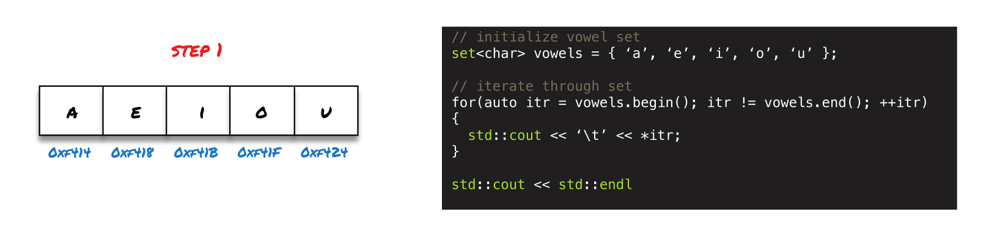
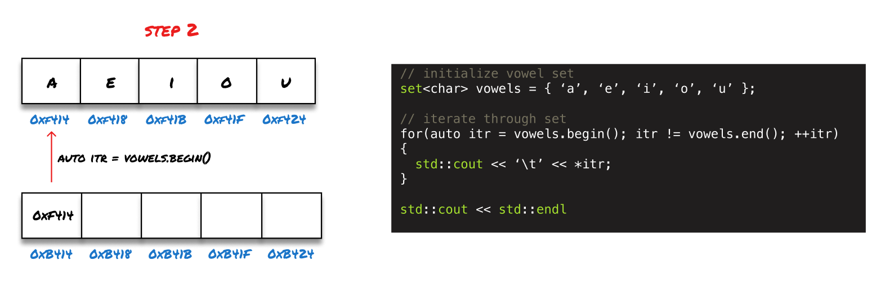
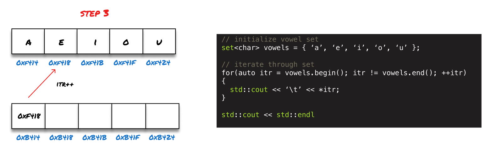
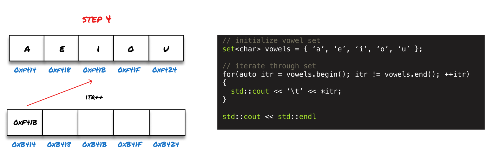
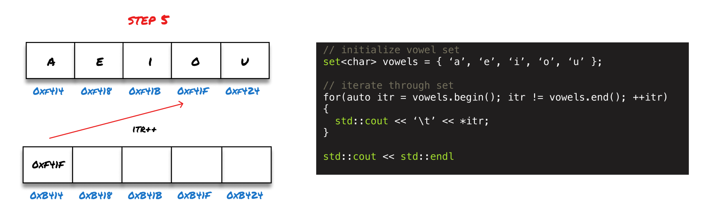
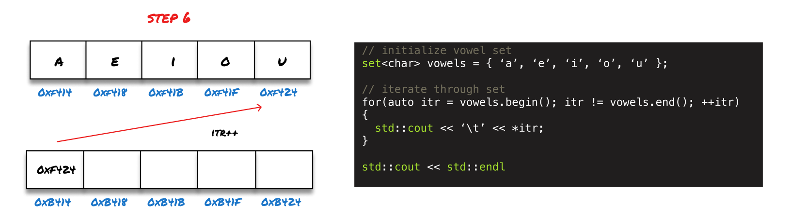
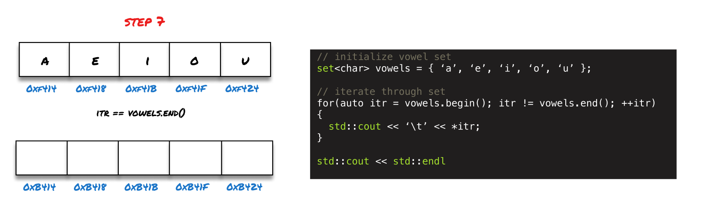

> [Code](https://github.com/rileymiller/riley-miller-personal-site/blob/master/content/blog/c%2B%2B-stl-set/main.cpp) referenced in article.

The Set data structure in C++ is a container used to hold unique values following a specific order. Contrary to **index-based** data structures
like **arrays** and **vectors**, sets are **key-based** data structures.

> **Key-based** containers like Sets and Maps use the data in the container itself to access the container, whereas,
> **index-based** containers like Arrays and Vectors are enumerated and allow for random access.

In a general sense, the Set is an opinionated container that is used to test for uniqueness and existence. Sets are
intentionally less flexible than index-based data structures which can perform many of same operations (find, contains). However,
since Sets are key-based, these operations are typically more readable.

One of the other nuances about Sets in C++ is that the data inside the container is **immutable**, data can be added and removed from the set but cannot be directly modified (mutated) like with arrays and vectors.

### Common Methods
Some of the common methods that the STL Set exposes for common set operations are:
* [begin()](http://www.cplusplus.com/reference/set/set/begin/): returns iterator to the beginning of the container
* [end()](http://www.cplusplus.com/reference/set/set/end/): returns iterator to the end of the container
* [size()](http://www.cplusplus.com/reference/set/set/size/): returns the size of the container
* [insert()](http://www.cplusplus.com/reference/set/set/insert/): inserts element in the container
* [find(const value_type& val)](https://www.cplusplus.com/reference/set/set/find/): searches container for an element, returns an iterator to the element if found, otherwise it returns an iterator to `set::end()`
* [erase()](http://www.cplusplus.com/reference/set/set/erase/): erases element from the container
* [clear()](http://www.cplusplus.com/reference/set/set/clear/): clears all of the contents of the container

### Iterators
I'll probably break this out into a separate post one day but iterators are usually pointers that point to a range of data within the C++ STL containers. Although, iterators are typically implemented as pointers, they can also be implemented in other ways. For the purpose of this article, we'll treat the iterators as pointers since that's how they're implemented in the STL Set.

Most of the methods in the STL Set leverage iterators to traverse the container to insert, count, find, and erase data. The Set returns several different iterators to the container but the `begin()` and `end()` functions are some of the most commonly used and are described above.

### How to Check if Set Contains an Element
Using the STL, the set exposes a method, `find(&val)`, which is used to check if an element is in the set. This method will search the container for the element and return an iterator to it if it finds it, otherwise, it will just return an iterator to the end of the set (`set::end()`). **e.g.:**

```cpp
template <class S>
void checkIfFound(std::set<S> s, S search) {
    if(s.find(search) != s.end()) {
        std::cout << "Found char: " << search << std::endl;
    } else {
        std::cout << "Did not find char.." << std::endl;
    }
}

int main() {
    std::set<char> vowels = { 'a', 'e', 'i', 'o', 'u'};

    checkIfFound(vowels, 'a');
    checkIfFound(vowels, 'x');
return 0;
}
```
In the code above, the find method is able to find `'a'` in the set and returns an iterator to the element. However, since `'x'` is not in the set, the `find('x')` method will return an iterator to the end of the set.

The code snippet above will print out:
```shell
$ ./set-find
Foud char: a
Did not find char..
$ echo $?
0
```

## How to Iterate Through a Set 
One of the first things that comes up with new programmers who are trying to learn how to use Sets in C++ is how to iterate through the data structure. I'm going to take you through a tutorial of how to iterate through a C++ set using the methods exposed in the STL.

### Step 1: Initialize the Set
There are several ways to initialize a set in C++ but we're going to initialize a set named `vowels` with its values immediately.



As shown in the code block above we initialize a `char` set  named `vowels` with the vowels of the English alphabet in the first line of code in the program. When we initialize our values in the set, the C++ program will then allocate these characters a certain space in memory as shown in the memory frame on the left.

### Step 2: Set up the Loop Body
Now that we've initialized the set, to iterate through the set we're going to use a `for` loop and iterators.



In the `for` loop we are going to set our loop iterator equal to the beginning iterator of the set by calling:
```cpp
auto itr = vowels.begin()
```

The `begin()` method is a built-in method exposed on the STL set and returns an iterator to the beginning of the container. In essence, this method returns a pointer which we can then use to iterate through the loop. We correspondingly use the `end()` method, which returns an iterator that points to the end of the container, to declare our loop's stopping cnodition. We then increment our loop each pass by incrementing the pointer which will increase the memory address of the pointer by the corresponding size of the pointer's data type. In this instance, we are using a char pointer so incrementing the pointer will increment the memory address by 1 byte.

### Step 3 - Step 6: Iterate Through the Container
Now that the `for` loop has been setup, it will execute the loop body and increment the iterator until the stopping condition is hit.









### Step 7: Stopping Condition Hit
After incrementing the iterator 5 times it will have printed out the contents of the set and on this last iteration it will perform one more check in the loop to see if the stopping codition was hit...

AHA!

The iterator address is now equal to the end iterator address so we break out of the loop.



The program will now clean up the iterator defined in the loop control as shown in the left side of the memory frame.

### Output
This code snippet prints out the contents of the set as shown below:
```shell
$ ./set-iteration
a   e   i   o   u
$ echo $?
0
```