This fall I'm teaching a section of Software Engineering at Colorado School of Mines. Software Engineering
is focused on teaching Software Engineering principles such as Pair Programming, unit testing, git, and many others. 

The course is taught in Java and students are required to use Eclipse for all of the Pair Programming projects. To facilitate
pair programming during COVID we are using a tool called Saros. Saros is an Eclipse plugin that allows developers to turn Eclipse into a collaborative IDE. 

This guide will assume that you have already installed Eclipse on your respective operating system and will focus
on getting you setup with Saros.

## Step 1 - Click Help > Install New Software
The first step to installing Saros in Eclipse is to navigate to the Help Menu and click the `Install New Software` Option.

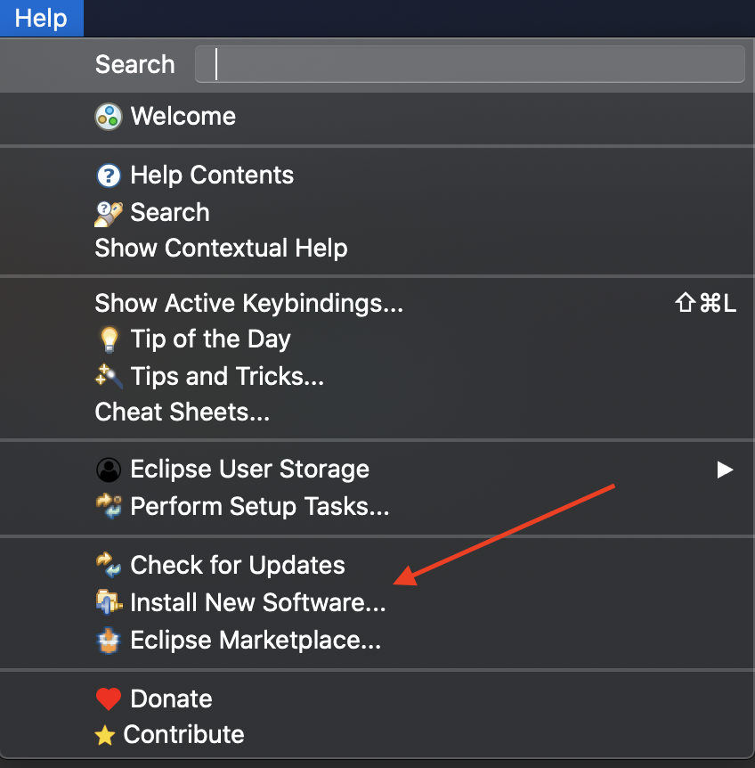

## Step 2 - Search for Saros in Install New Software Menu
Next, you will type in `Saros` in the `Work with:` input at the top of the Install New Software menu. This will then
retrieve a package called DPP which you will expand in the menu below where you will then click the radio button next
to Saros before clicking `Next`.

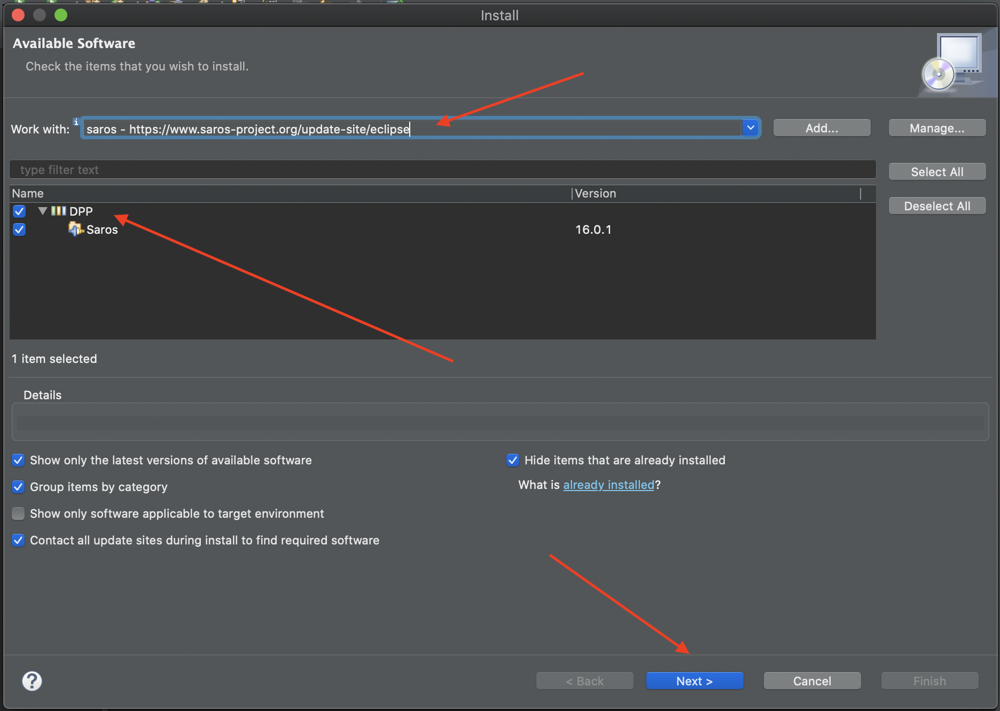

## Step 3 - Verify Saros Installation
This will then take you to a screen called `Install` where it should show the version of Saros that you are trying to install. Now click the
`Next` button on the `Install` screen.

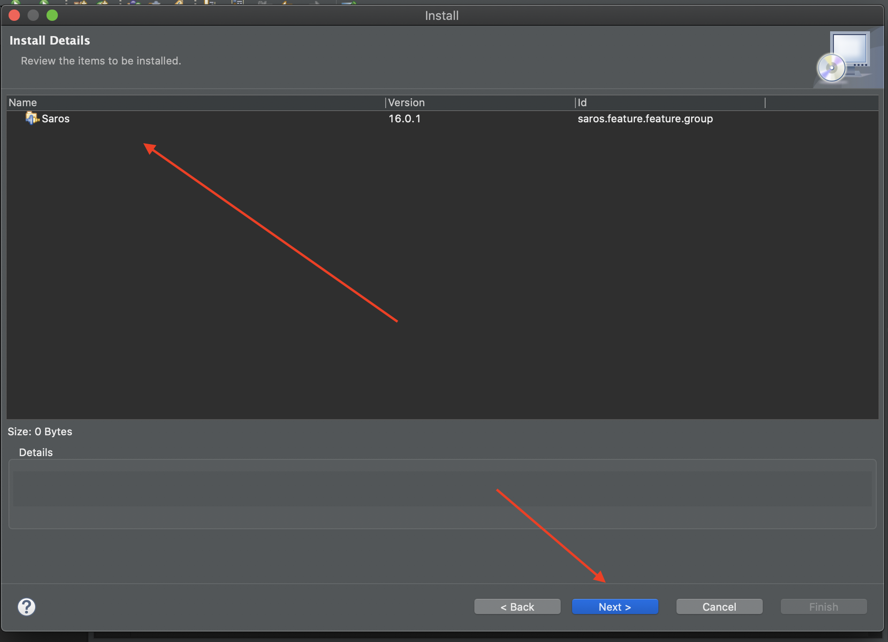

## Step 4 - Accept License Aggreement
After confirming the details of the Saros installation. Accept the license aggreement and click `Finish`.

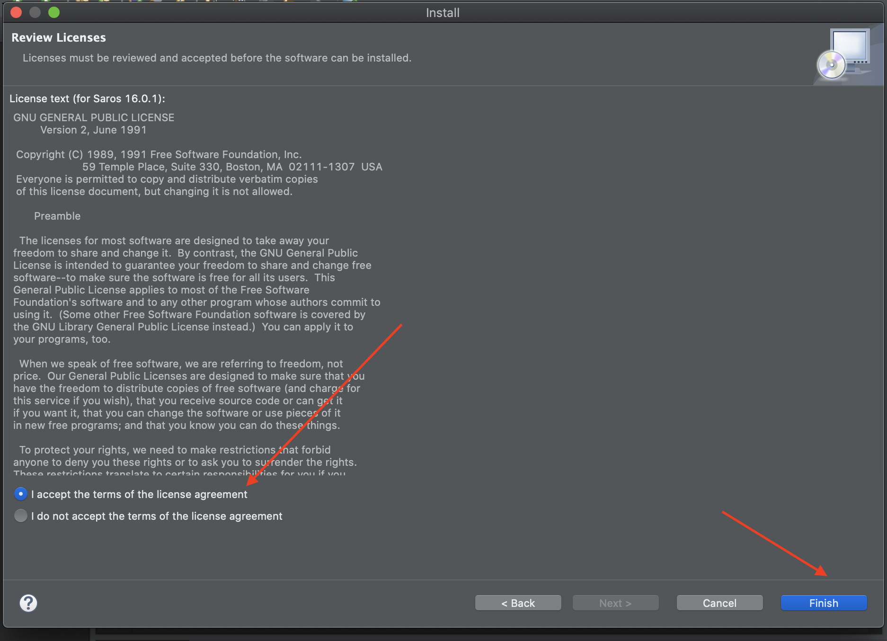

## Step 5 - Restart Eclipse
After installing Saros, Eclipse will prompt you to restart Eclipse. Click `Restart Now`.

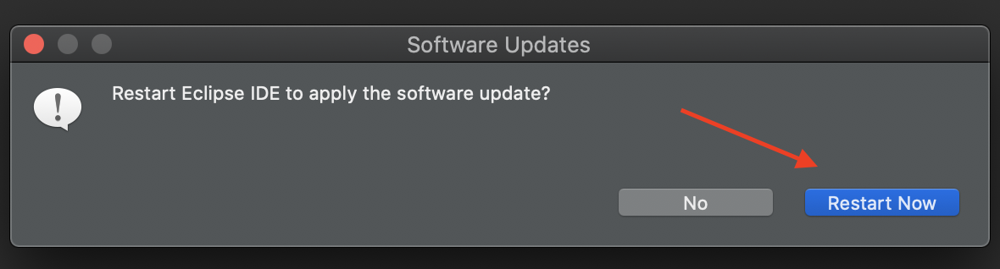

## Step 6 - Open Saros Menu and Click Start Saros Configuration
After restarting Eclipse, click the `Saros` menu and then click `Saros > Start Saros Configuration`.

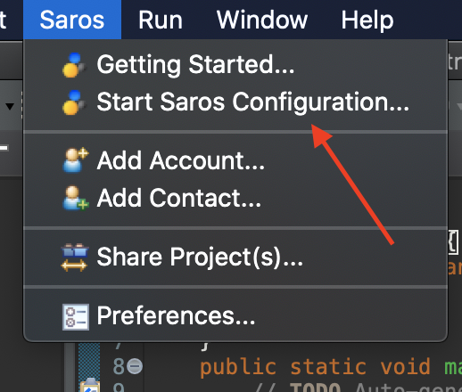

## Step 7 - Signup for XMPP Account
After clicking `Saros > Start Saros Configuration` it will take you to a popup and ask you to enter your
XMPP account credentials. To create a XMPP account click on the link in the middle of the account.

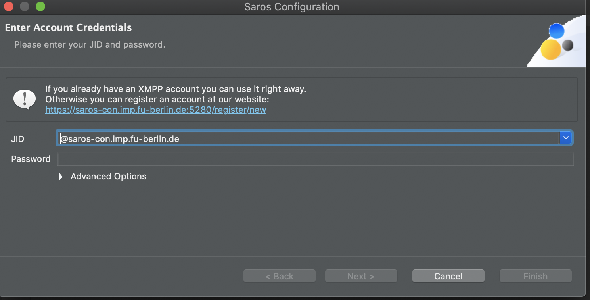

This will take you to a signup page for the Saros XMPP server.

## Step 8 - Create XMPP Account
On the webpage `Register a Jabber account`, put in your account information that you plan on using for your
Saros sessions. In the middle of the screen you will see an input titled `Server`, this is the server address (`saros-con.imp.fu-berlin.de` at
the time of this writing)
that your XMPP account will be hosted on. Also make sure that you write down or remember the username of your XMPP
account because we will need this later on in the Saros setup.

After filling out your username, password, and the captcha click the `Register` button.

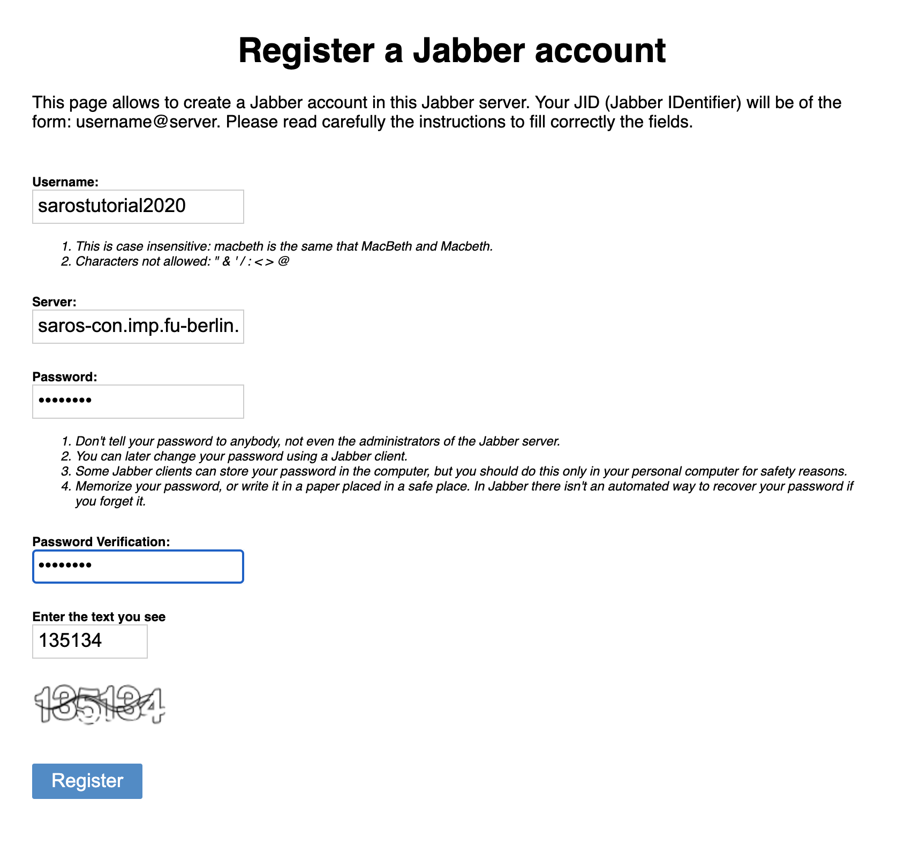

## Step 9 - Enter Saros Account Credentials
After registering your account on the Saros XMPP server, navigate back to eclipse and enter your account credentials.
In the input `JID` it will autopopulate with the Saros XMPP server `@saros-con.imp.fu-berlin.de` but you **MUST** type in
the username you used to register your account before the server address otherwise it will not let you proceed with the Saros
setup and will not give you any error messages when you click the `Finish` button at the end of the configuration setup.

After typing in your valid `JID`, type in your password and click through the rest of the configuration setup, finally clicking
`Finish`.

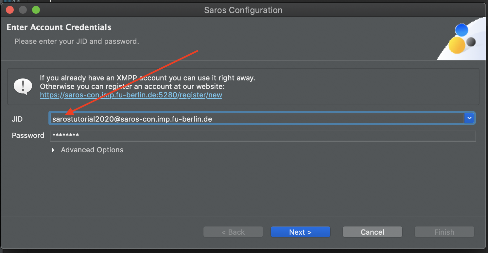 

## Step 10 - Enable Saros View
After adding your XMPP account, show the Saros view by clicking `Window > Show View > Other`.

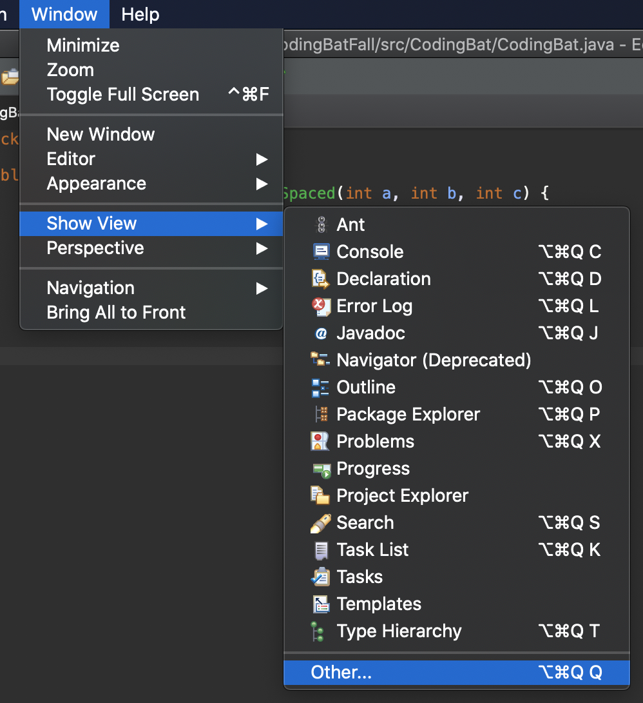 

Then in the `Show View` menu click `Saros > Saros` and then click the `Open` button.

 

## Step 11 - Add Contacts
After setting your own account up you will then add whoever you're trying to start a session with as a contact by clicking
`Saros > Add Contact`.

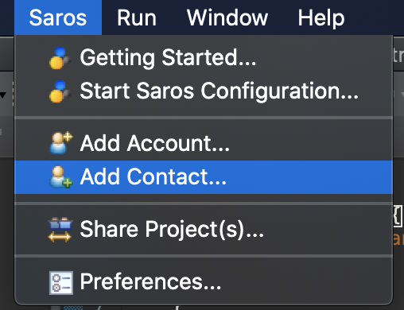 

Then in the `Add Contact` menu add your teammate by their `JID` and click finish.

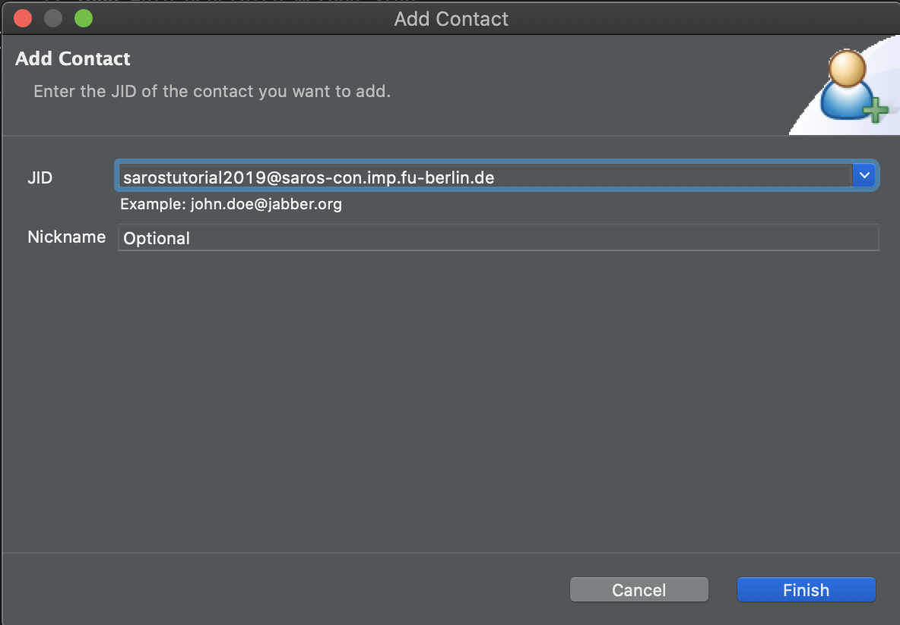 

## Step 12 - Share Project and Start Session
After adding your teammate as a contact. Right click on the project you are trying to work on together in the Eclipse Package Explorer sidebar and click the `Share Project` option.

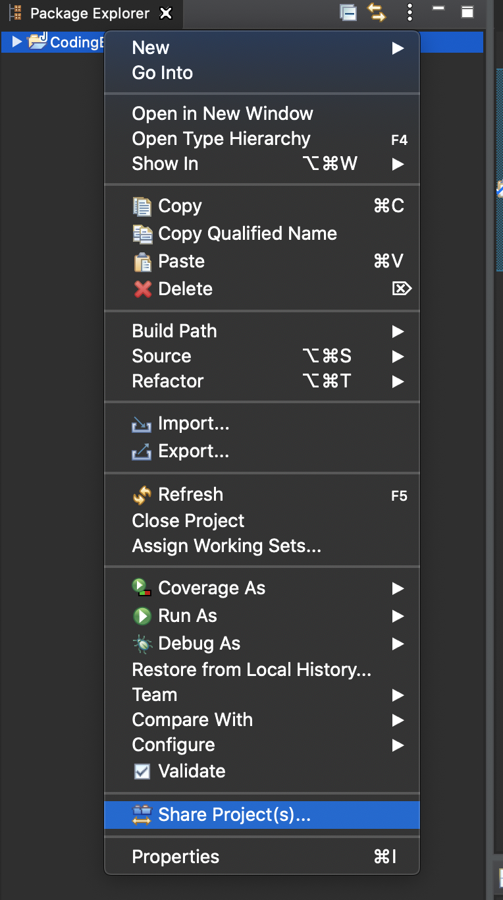 

This will then open up a Share Project popup where you will then click the project you wish to share and then click the `Next` button.

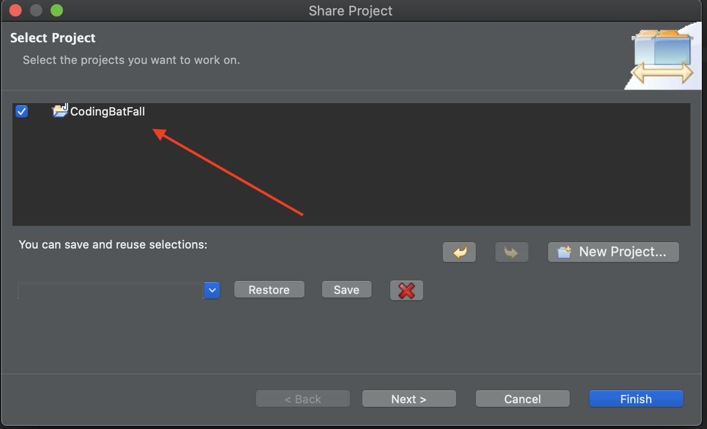 

The next screen will prompt you for the contact that you wish to start a session with. **NOTE:**, your partner must accept your request to
become contacts and _also_ be online in order for them to show up on this `Select Contact` screen otherwise it will appear blank like the screen
below. 

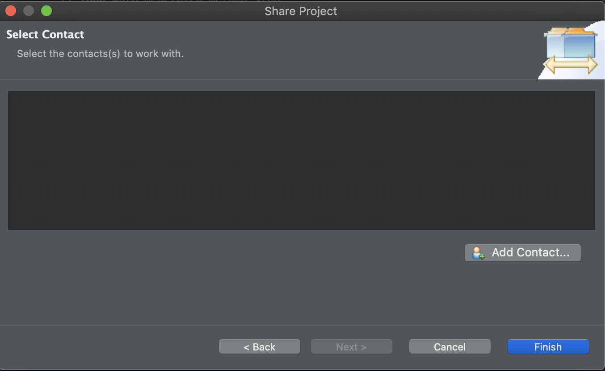 

When your teammate is online and has accepted your request, click on their name and then click `Finish`.

_Voila!_

You've now started a collaborative editing session with your partner and you will be able to see each other's cursors in the IDE.
